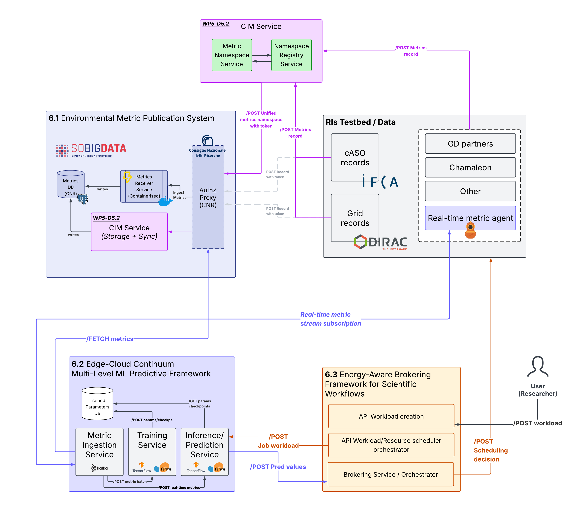
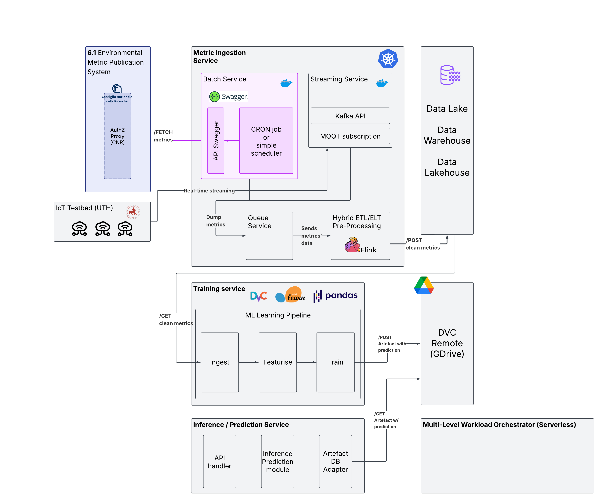

# 🌱🌍♻️ ECoMEP - Edge-Cloud Continuum Multi-Level ML Energy Prediction Framework (GreenDIGIT project)

>**Disclaimer**: the information on this README is still temporary. The tools, architecture and other specifications are subject to change.

> Part of GreenDIGIT WP6.2 — Predictive AI for Federated Energy-Aware Workflows  
> Developed in collaboration with SoBigData RI, IFCA, DIRAC, and GreenDIGIT RIs and partners.


## Overview

This framework enables **real-time predictive modelling** across **Edge–Fog–Cloud infrastructures** using **multi-level machine learning pipelines**. It ingests environmental and performance metrics (e.g. energy, CPU usage, workload profiles) from **distributed clusters and IoT devices**, processes them, and trains models to **forecast resource usage, network load, and system performance**.

Deployed as part of the **GreenDIGIT WP6.2** research activities, this module integrates with:

- [WP6.1 Environmental Metric Publication System](#)
- [WP6.3 Energy-Aware Brokering Framework](#)
- UTH real-time IoT metrics infrastructure, data and workloads
- SoBigData RI metrics ecosystem
- IFCA and DIRAC records infrastructure

### To-dos (create tickets)
- [ ] Testbed implementation IoT with UTH
- [ ] DVC assets imported from remote storage (GDrive or AWS)
- ML model is quite simple. Things to improve.
  - [ ] XGBoost, CatBoost (or other SoTA gradient boost tool-algo)
  - [ ] Deep Learning: Convolutional Neural Network (LSTM, Temporal Convolution, Transformer) with PyTorch or TensorFlow
  - [ ] Use `scikit-learn-onnx` for more adaptability to edge-devices
  - [ ] Integrate MQTT and/or Prometheus for edge-optimised messaging telemetry between devices (for the Edge)
- [ ] Metrics' ingestion: batch + real-time streaming (Kafka)

---

## Current Features
- Ingest, Featurise and Train stages in-built as a pipeline (with DVC tracking).
- FastAPI server `/predict` endpoint with a `{"power_forecast":<number>}` result.
- MQTT + Kafka + Flink streaming pipeline

### MQTT + Kafka + Flink pipeline tutorial (development)
1. Install `docker-compose` with all containerised services (MQTT + Kafka).
```bash
cd streaming_service # you should see a docker-compose.yaml if you run ls -la
docker compose up -d --build
```
This will spin-up several services included in the compose file, including Kafka-UI, MQTT broker/subscriber and a Kafka bridge that ingests that service.
To see the logs from MQTT and Kafka respectively:
- `docker logs -f mqtt`
- `docker logs -f mqtt_to_kafka`

2. To start the synthetic workloads
```bash
# Go to the synthetic metrics' workload folder.
cd synthetic_metrics_service

# If you do not have the environment installed.
python -m venv .
source bin/activate

# Inside our environment:
python metrics_publisher.py
# From here you should see metrics being recurrently logged.
```

3. Kafka -> ELT (Flink SQL) -> Iceberg + MinIO
```sh
# Some useful command to list Kafka's topics, for debugging.
docker exec -it kafka kafka-topics.sh --bootstrap-server localhost:9092 --list

docker exec -it kafka /opt/bitnami/kafka/bin/kafka-topics.sh --bootstrap-server localhost:9092 --list
docker exec -it kafka /opt/bitnami/kafka/bin/kafka-configs.sh --bootstrap-server localhost:9092 \
  --entity-type topics --entity-name metrics.raw.stream --describe

```

4. Generating metrics (temporary)
```sh
# 1) Generate namespaces.json
python generate_namespaces.py --n 12

# 2a) Use existing namespace.json (no auto-generate nodes) (defaults SourceType=IoT)
python generate_synthetic_metrics.py --days 1 --freq-mins 3

# 2b) (Optional) autogenerate 12 IoT nodes
python generate_synthetic_metrics.py --autogen-nodes 12 --days 1 --freq-mins 3

# 3) Publish metrics
# 3-second fixed cadence, override payload timestamps to "now", IoT only
PACE_MODE=cadence CADENCE_S=3 OVERRIDE_TS=true SOURCE_TYPE=IoT \
BROKER=localhost PORT=1883 TOPIC_ROOT=greendigit QOS=1 \
python metrics_publisher.py

# Or: respect recorded Δts (scaled), keep original timestamps
PACE_MODE=replay_ts REPLAY_SPEED=2.0 OVERRIDE_TS=false SOURCE_TYPE=IoT \
python metrics_publisher.py

```

---

## Architecture
### Overview Architecture

- [ ] TODO: write description.

### Data Flow Architecture

- [ ] TODO: write description.

## Machine Learning Pipeline

### Ingestion & Preprocessing
- Collect metrics from edge nodes, sensors, and cluster logs
- Use **MQTT**, **Prometheus**, or **Kafka/NATS**
- Normalie, timestamp-align, and validate data

### Model Training
- Train using:
  - **Time Series Forecasting** (LSTM, Prophet)
  - **Regression/Classification** (XGBoost, RF)
  - **Energy/Latency Prediction**
- Tools: **PyTorch**, **TensorFlow**, **Scikit-learn**

### Real-Time Inference
- ONNX or TensorFlow Lite models served at edge
- Model registry: MLflow or DVC-based

---

## Folder Structure
- [ ] Refactor and write the folder structure in MD here.

<!-- ```bash
.
├── ingestion/             # Metric ingestion and connectors
├── preprocessing/         # Data cleaning and transformation
├── training/              # Training scripts and model tracking
├── inference/             # Model serving scripts (ONNX, Lite)
├── deployment/            # Helm charts, Dockerfiles
├── crate/                 # RO-Crate metadata, licences, schema
├── ro-crate-metadata.json
├── Dockerfile
├── requirements.txt
└── README.md
``` -->

<!-- ### New version
```bash
EdgeCloudPredictive/
├── ingestion/                # Kafka consumers, schema
├── preprocessing/            # Feature builders, GreatExp suites
├── training/                 # PyTorch/Sklearn code, MLflow configs
├── inference/                # FastAPI server, ONNX / TFLite loaders
├── scripts/                  # ML ingestion, featurise + training steps
├── server/                   # Containerised FastAPI server for HTTP prediction request
├── deployment/               # Helm charts, Dockerfiles
│   ├── helm/                 # Chart for Training & Inference services
│   └── gha-workflows/        # CI/CD YAML
├── crate/                    # RO-Crate metadata, licences, schema
├── ro-crate-metadata.json
└── notebooks/                # EDA & experiment design
``` -->

## Outputs and Publications
Unified JSON or RO-Crate formatted metrics

- `/FETCH` endpoint compatible with WP6.1 publication system
- Optionally `POST`ed to:
    - cASO and Grid record services
    - CIM record registry with auth token

### Interoperability
- RO-Crate compliant for FAIR metadata
- Containerised for deployment in federated clusters
- Compatible with SoBigData metrics registry and Dirac grid APIs
- Modular, with pluggable ML models and data formats

## Citation
```
@software{GreenDIGIT_WP62,
  title = {Edge-Cloud Continuum Multi-Level Predictive Framework},
  author = {GreenDIGIT WP6.2 Contributors},
  year = {2025},
  version = {v1.0},
  url = {https://github.com/GreenDIGIT/WP6.2-Predictive-Framework}
}
```

## Contributors
Gonçalo Ferreira – UvA Researcher - WP6.2 Developer
- [ ] [Collaborators, Partners]

Supported by GreenDIGIT, SoBigData RI, IFCA, DIRAC, and CNR.

## Contact
For questions, integration requests or metric schema definitions, contact:

GreenDIGIT WP6.2 Team
📧 contact@greendigit.eu
🌐 greendigit.eu

---

### Notes Serverless (temporary)
Followed the [Official Golang-Http OpenFaaS](https://docs.openfaas.com/languages/go/#add-your-own-sub-modules) documentation to set the first experiment.

1. First we must set the Kubernetes environment. OpenFaaS works with automatic deployment to a Kubernetes cluster with pre-defined namespaces `openfaas` and `openfaas-fn`.

```sh
# Helm, Kubernetes (kubectl), arkade and faas-cli must be installed.
kubectl create ns openfaas
kubectl create ns openfaas-fn

helm repo add openfaas https://openfaas.github.io/faas-netes
helm repo update

helm upgrade openfaas --install openfaas/openfaas \
  --namespace openfaas \
  --set gateway.directFunctions=true \
  --set generateBasicAuth=true

# port-forward (dev only)
kubectl -n openfaas port-forward svc/gateway 8080:8080 &

```

2. Now create the template, alter the `stack.yaml` with the image from my `goncaloferreirauva` DockerHub repository. There are some workarounds needed for the "default" commands from `faas-cli`.
```sh
# Install templates and handler function.
faas-cli template store pull golang-middleware
faas-cli new --lang golang-middleware echo

# This will build the Docker image, but not push it.
faas-cli build  -f stack.yaml

# We must add a tag to the echo Docker image and push
# to your own DockerHub repo. Substitute $YOUR_USERNAME
# with your own.
docker tag echo:latest $YOUR_USERNAME/echo:latest
docker push $YOUR_USERNAME/echo:latest

# Just to test if the cluster is correctly set:
kubectl get pods -n openfaas
kubectl get svc -n openfaas

# Just for dev, port-forward
kubectl port-forward -n openfaas svc/gateway 8080:8080
# This will lock your terminal. To test this, you must do so from other terminal.
```

3. Finally, the first curl:
```sh
curl -X POST http://localhost:8080/function/echo
> Hello World!%
```